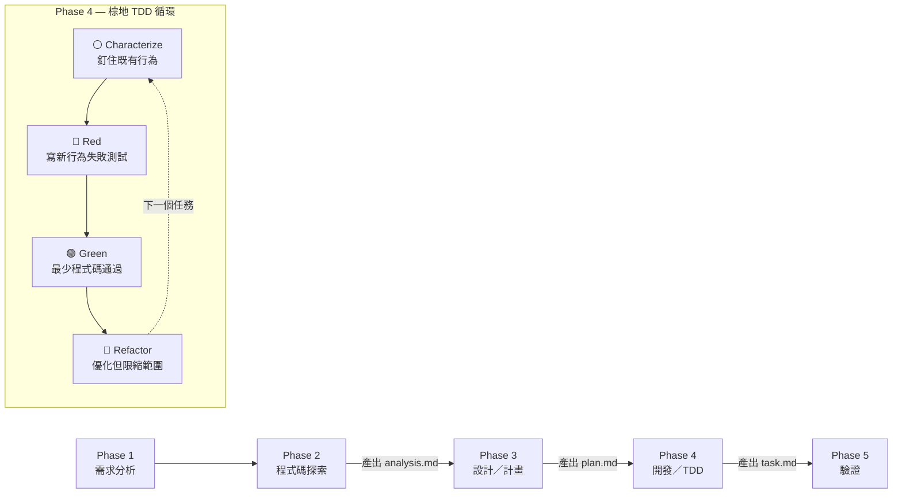

# Dev Workflow

通用軟體開發工作流程，適用於前端與後端開發。預設為棕地專案優先，綠地專案可豁免特定步驟。

## 流程總覽



> 綠地專案可省略 Characterize 步驟，直接從 Red 開始。

每個階段必須滿足退出條件才能進入下一階段。任何階段發現問題可回退到前一階段修正。

## 核心紀律（棕地優先）

本流程預設專案為棕地（已有既有程式碼、使用者、測試）。在所有階段中，三條紀律凌駕於其他考量：

1. **先理解再修改（Understand-First）**：任何修改前，必須先掌握被修改程式碼的呼叫方、行為契約、測試覆蓋狀況。沒有這些資訊就規劃方案，視為流程違規。
2. **保護既有行為（Behavior Preservation）**：除非需求明確要求改變舊行為，否則所有舊行為必須保持不變。任何修改都應有測試保護「舊行為仍正常」。
3. **最小擾動（Minimal Diff）**：只修改完成需求所必要的程式碼。不順手重構不相關區域、不順手改格式、不順手「優化」。每一行 diff 都應能回答「這行為什麼必要？」。

> **綠地專案豁免**：若使用者明確聲明這是綠地專案（無既有使用者、無既有測試需保護），可豁免紀律 2 的 characterization 要求。紀律 1 與 3 仍適用。

### 不該動什麼（硬規則）

LLM 在 Refactor 階段最常見的失誤是「順手改」。以下情境必須停手：

- 與當前任務無直接關聯的檔案 → 不動
- 與當前任務無直接關聯的函式（即便就在同一檔案中）→ 不動
- 程式碼風格、格式、import 順序的「美化」→ 不動（除非任務本身就是 lint/format）
- 看起來「應該重構」但沒有測試保護的舊程式碼 → 不動，只在 followups.md 中記錄
- 第三方套件版本升級 → 不動，需獨立任務處理

若在執行中發現「真的很想改但不在範圍內」的程式碼，記錄到 `.tmp/followups.md`，由使用者決定是否另開任務。

### Self-Check 執行原則

每個 Phase 結束時須執行對應的 self-check checklist。執行 self-check 時：

1. **逐項實際驗證，不可橡皮圖章**：每一項都必須對照剛產出的文件或程式碼實際確認，不可憑印象勾選
2. **未通過項目必須具體說明**：若某項打 `[ ]`，必須在下方寫出「未通過原因」與「補救方式」
3. **任一項未通過則退回該階段補完**：不可帶著未通過項進入下一階段
4. **Self-check 結果寫入對應文件末尾**：保留檢查痕跡，方便後續追溯
5. **使用者可隨時要求重跑 self-check**：若使用者對某階段品質有疑慮，重跑該階段 self-check 並回報結果

> Self-check 的目的不是形式化驗收，而是強迫 Claude 在切換階段前停下來檢視自己的產出。若發現自己想跳過某項或敷衍勾選，這就是該項真正需要被檢查的訊號。

## 文件管理規範

所有階段產出的文件統一存放於專案根目錄的 `.tmp/` 資料夾下。

**文件清單**：
- `.tmp/analysis.md` — Phase 1+2 的需求分析與程式碼探索結果
- `.tmp/plan.md` — Phase 3 的設計計畫與技術決策
- `.tmp/task.md` — Phase 4 的開發任務 Checklist
- `.tmp/followups.md` — 流程中發現但不在當前範圍內的改進建議

**備份規則**：
- 產生新文件前，檢查是否已存在同名文件
- 若存在，將舊文件重新命名為 `{原檔名}.{YYYYMMDD-HHmmss}.md`（例如 `analysis.20250611-143022.md`）
- 再建立新文件

**目錄初始化**：
- 每次流程開始前，確認 `.tmp/` 目錄存在，若不存在則建立
- 建議將 `.tmp/` 加入 `.gitignore`

### followups.md 範本

````markdown
# 後續建議事項

> 產生時間：{YYYY-MM-DD HH:mm}
> 來源需求：{需求摘要}

本流程中發現但**不在當前範圍**的改進機會。請評估是否另開任務處理。

## 建議項目

### 1. {標題}
- **發現於**：Phase {N}, {context}
- **位置**：`{file:line}`
- **現況**：{描述}
- **建議**：{描述}
- **優先級**：高/中/低
- **預估規模**：小型/中型/大型
````

## Phase 1: 需求分析

**目的**：釐清「做什麼」和「為什麼」。

執行步驟：
1. 確認需求的具體內容和範圍
2. 使用 **AskUserQuestion tool** 與使用者互動，釐清模糊點和不確定的部分。主動提問而非假設，典型問題包含：
   - 功能的邊界在哪裡？（做到什麼程度、不做什麼）
   - 是否有相關的 UI/UX 設計稿或 wireframe？
   - 是否有既有的類似功能可參考？
   - 對效能、相容性是否有特殊要求？
   - 這是棕地或綠地專案？是否有既有使用者/行為需要保護？
3. 定義驗收標準，**必須分為兩類**：
   - **Positive Criteria（新行為）**：本次需求要達成的新功能、新能力
   - **Regression Criteria（舊行為保護）**：哪些既有行為在本次修改後必須保持不變
   - 若無法列出 Regression Criteria（例如不知道目前有哪些行為），這就是 Phase 2 探索的明確目標之一
4. 識別可能的風險和限制

**退出條件**：
- 需求範圍明確，無模糊地帶
- 雙欄驗收標準已列出並獲使用者確認
- 已識別已知風險和限制

### Phase 1 Self-Check

在進入 Phase 2 前，逐項確認：

- [ ] 需求摘要可用一句話描述，且使用者已明確同意
- [ ] Positive Criteria 至少有 1 條，且每條可驗證（能寫出對應的測試或檢查方式）
- [ ] Positive Criteria 沒有出現「應該變得更好」「使用者體驗提升」這類無法驗證的描述
- [ ] Regression Criteria 至少有 1 條，或已明確標註「綠地專案無此需求」
- [ ] 已確認專案類型（棕地/綠地），不是模糊狀態
- [ ] 已識別至少 1 項風險或限制（若真的沒有風險，需寫明原因）

未通過項目處理：
{若有 [ ] 項，於此說明原因與補救方式}

**產出**：向使用者輸出需求摘要，包含範圍、雙欄驗收標準、風險。等待使用者確認後進入 Phase 2。

> 注意：Phase 1 的結果暫存於記憶中，待 Phase 2 完成後一併寫入 `analysis.md`。

## Phase 2: 程式碼探索

**目的**：了解現有架構、行為契約、風險訊號，為設計提供依據。

**執行方式**：使用 **Agent tool**（`subagent_type: Explore`）派出子代理進行三軸探索：靜態軸、動態軸、歷史軸。每軸可獨立派一個 sub-agent 並行執行，避免大量搜尋結果佔用主要 context window。

### 靜態軸：程式碼結構

```
根據以下需求，探索程式碼庫的靜態結構並回報：
1. 與需求相關的檔案清單（路徑、用途、是否需修改）
2. 現有架構模式與設計慣例（命名、結構、風格）
3. 相關模組的相依關係（depends on / depended by）

需求描述：{從 Phase 1 得到的需求摘要}
```

### 動態軸：行為契約與影響範圍

```
針對以下需修改的目標檔案/函式，回報：
1. 反向依賴：誰呼叫了這些函式？列出所有呼叫點（檔案 + 行號）
2. 行為契約：呼叫方對這些函式有哪些隱含假設？
   - 輸入格式假設
   - 回傳值/副作用假設
   - 錯誤處理假設（會不會 throw？回 null？）
   - 執行順序假設（同步/非同步、前置條件）
3. 測試覆蓋現況：
   - 哪些行為已有測試保護？（列出測試檔案 + 測試名稱）
   - 哪些行為「沒有」測試保護？（這是 Phase 4 需要補 characterization tests 的區域）
4. 資料流：相關資料從哪裡來、到哪裡去？是否跨越 API/DB/外部服務邊界？

目標檔案/函式：{從靜態軸結果得到的修改目標}
```

### 歷史軸：風險訊號

```
針對以下檔案，從 git history 蒐集風險訊號：
1. 過去 6 個月的修改頻率（高頻修改 = 不穩定區域 = 高風險）
2. 是否有 revert commit？revert 的原因？
3. 最近一次重大變更的 commit message 與相關 PR 描述
4. 是否有 TODO / FIXME / HACK 註解？內容為何？

目標檔案：{從靜態軸結果得到的修改目標}
```

執行順序：靜態軸通常先做，動態軸與歷史軸可並行。若任一軸的回報不夠完整，可追加探索或在主 context 中補充閱讀關鍵檔案。

**退出條件**：
- 已掌握相關程式碼的結構和模式（靜態軸完成）
- 已識別所有反向依賴與行為契約（動態軸完成）
- 已掌握風險訊號（歷史軸完成）
- 已識別需要補 characterization tests 的區域

### Phase 2 Self-Check

在進入 Phase 3 前，逐項確認 `.tmp/analysis.md`：

**結構完整性**：
- [ ] 1.3.1 Positive Criteria 已從 Phase 1 結轉並完整列出
- [ ] 1.3.2 Regression Criteria 已列出（綠地除外）
- [ ] 2.1 相關檔案清單已列，每個檔案的「需修改」與「修改類型」欄位已填
- [ ] 2.3 對每個需修改的目標都有對應的「呼叫方」「行為契約」「測試覆蓋」三段資訊
- [ ] 2.4 風險訊號表格已填寫，每個檔案有風險評級
- [ ] 2.5 影響範圍總評不是空白或「無特別影響」這種敷衍描述

**內容深度**（這幾項最容易敷衍，要特別檢查）：
- [ ] 反向依賴的「呼叫方」有具體 `file:line`，不是只寫「多處」「若干」
- [ ] 行為契約的四個維度（輸入/輸出/錯誤/順序）都有實際內容，不是 `{假設}` 占位符
- [ ] 「未覆蓋」的測試空白區有具體列出，不是寫「大部分有覆蓋」這種模糊描述
- [ ] 風險評級若標「低」，已說明判斷依據（不是因為偷懶才標低）

**棕地專案額外檢查**（綠地可略）：
- [ ] 至少跑過動態軸探索一次（不可只做靜態軸就進 Phase 3）
- [ ] 歷史軸有實際結果（即便答案是「無 revert、修改頻率低」也要明示）

未通過項目處理：
{若有 [ ] 項，於此說明原因與補救方式}

**產出**：

1. 向使用者報告探索結果，列出影響範圍、風險評級、關鍵發現
2. 產生 `.tmp/analysis.md`，內容結構如下：

````markdown
# 需求分析與程式碼探索報告

> 產生時間：{YYYY-MM-DD HH:mm}
> 需求摘要：{一句話描述}
> 專案類型：棕地 / 綠地

## 1. 需求分析

### 1.1 需求描述
{需求的具體內容}

### 1.2 需求範圍
{功能範圍與邊界}

### 1.3 驗收標準

#### 1.3.1 Positive Criteria（新行為）
- [ ] {新功能應達成的標準 1}
- [ ] {新功能應達成的標準 2}

#### 1.3.2 Regression Criteria（舊行為保護）
- [ ] {既有功能 X 在修改後仍正常運作}
- [ ] {既有 API contract 不變}
- [ ] {既有資料格式仍能處理}

### 1.4 風險與限制
- {風險 1}
- {風險 2}

## 2. 程式碼探索

### 2.1 相關檔案清單（靜態軸）
| 檔案路徑 | 用途 | 需修改 | 修改類型 |
|---------|------|--------|---------|
| {path} | {description} | ✅ / ❌ | 新增/修改/刪除 |

### 2.2 現有架構與慣例
- 架構描述：{description}
- 命名規則：{description}
- 設計模式：{description}

### 2.3 反向依賴與行為契約（動態軸）
針對每個需修改的目標：

#### {目標函式/模組 1}
- **呼叫方**（共 N 處）：
  - `{file}:{line}` — {使用情境}
- **行為契約**：
  - 輸入：{假設}
  - 輸出：{假設}
  - 錯誤：{假設}
  - 順序：{假設}
- **測試覆蓋**：
  - 已覆蓋：{test file/name}
  - **未覆蓋**（Phase 4 須補 characterization）：{behavior description}

### 2.4 風險訊號（歷史軸）
| 檔案 | 修改頻率 | revert 紀錄 | TODO/FIXME | 風險評級 |
|------|---------|------------|-----------|---------|
| {path} | {N times / 6mo} | {yes/no} | {內容} | 高/中/低 |

### 2.5 影響範圍總評
{綜合三軸資訊，評估本次修改的影響範圍與風險等級}
````

## Phase 3: 設計（計畫）

**目的**：決定「怎麼做」，制定具體的實現方案，並選定修改策略以控制風險。

**輸入**：讀取 `.tmp/analysis.md` 作為設計依據。

**重要**：此階段不使用 EnterPlanMode。由 skill 自行管理計畫流程，確保後續階段不被中斷。

執行步驟：
1. 讀取 `.tmp/analysis.md`，掌握需求、行為契約、測試空白區、風險訊號

2. **選擇修改策略**（棕地必做）：
   根據 analysis.md 的反向依賴數量、風險評級、是否影響 public API，從以下策略中選擇一種或組合：

   | 策略 | 適用情境 | 代價 |
   |------|---------|------|
   | **直接修改** | 反向依賴 ≤ 3、無 public API、低風險區 | 最簡單，但測試保護要求高 |
   | **Adapter / Wrapper 隔離** | 需改變內部實作但要保留外部介面 | 多一層間接，但隔離風險 |
   | **平行新舊並存（Strangler Fig）** | 大型重構或邏輯顛覆，無法一次切換 | 短期程式碼膨脹，長期可控 |
   | **Feature Flag** | 需要漸進釋出或快速回滾能力 | 增加分支，但提供安全網 |
   | **新建+棄用（不刪）** | 既有 API 不能立即移除（外部使用者） | 留下 dead code，需後續清理計畫 |

   策略選擇必須**寫入 plan.md** 並說明理由。

3. **確認與本次需求直接相關的技術決策**：
   - 確認涉及的框架、套件版本，僅記錄影響設計方案的項目
   - 確認測試框架與相關工具

4. **查閱最新技術文件**（必要時）：
   - 套件相關：使用 MCP tool `mcp__context7__resolve-library-id` 解析相關套件的 library ID，再使用 `mcp__context7__query-docs` 查詢最新的 API 用法、最佳實踐、breaking changes
   - 專案內部歷史決策：用 git log / grep 查相關 commit、CHANGELOG、註解
   - 適用情境：引入新依賴、不確定既有寫法是否仍是最佳實踐、看到不熟悉的內部慣例

5. **設計解決方案**，包含：
   - 修改清單（新增/修改/移除）
   - **Rollback 策略**：萬一修改後發現問題，如何快速回退？
   - **資料相容性**：是否涉及資料格式變更？舊資料如何處理？
   - 邊界情況與錯誤處理

6. **向使用者呈現完整設計方案**，使用 AskUserQuestion 確認或調整

7. 確認後產生 `.tmp/plan.md`

**退出條件**：
- 修改策略已選定且有明確理由
- 實現方案具體且可執行
- Rollback 策略明確
- 方案已獲使用者明確確認
- `.tmp/plan.md` 已產生

### Phase 3 Self-Check

在進入 Phase 4 前，逐項確認 `.tmp/plan.md`：

**結構完整性**：
- [ ] 第 1 節技術決策已填，僅列與本次相關的項目（不是把所有相依套件都列上）
- [ ] 第 2 節修改策略已明確選定一種或組合
- [ ] 第 3 節 Rollback 策略已具體寫出回退步驟
- [ ] 第 4 節資料相容性已明確標註是否涉及格式變更
- [ ] 第 5 節規劃方向有「新增/修改」項目（移除可選）
- [ ] 第 6 節修改檔案清單已列，每個檔案的「操作」與「說明」欄位已填
- [ ] 第 7 節風險評估已寫，不是空白

**修改策略品質**（最容易敷衍的環節）：
- [ ] 修改策略的「選擇理由」有對照 analysis.md 的反向依賴數、風險評級、是否影響 public API
- [ ] 若選了「直接修改」，反向依賴 ≤ 3 且風險評級為低（否則需要更隔離的策略）
- [ ] 若涉及 public API 變更，已選擇 Adapter / Strangler Fig / Feature Flag 其中之一
- [ ] 「策略落地方式」有具體描述如何實現，不是只重複策略名稱

**Rollback 品質**：
- [ ] 回退觸發條件具體（例如「發現 X 行為異常」），不是「有問題時」
- [ ] 回退步驟可執行（例如有 commit hash、flag 名稱），不是「revert 變更」這種模糊描述

**對齊使用者**：
- [ ] 已用 AskUserQuestion 向使用者呈現完整方案
- [ ] 使用者明確同意（不是「沒反對所以視為同意」）

未通過項目處理：
{若有 [ ] 項，於此說明原因與補救方式}

**產出**：

產生 `.tmp/plan.md`，內容結構如下：

````markdown
# 設計計畫

> 產生時間：{YYYY-MM-DD HH:mm}
> 需求摘要：{一句話描述}
> 參考文件：.tmp/analysis.md

## 1. 技術決策

與本次需求相關的技術選型與版本確認：
| 項目 | 版本 | 決策理由 |
|------|------|---------|
| {item} | {version} | {reason} |

### Context7 / 內部歷史查閱結果（如有）
| 來源 | 查閱重點 | 關鍵發現 |
|------|---------|---------|
| {package / commit / PR} | {query topic} | {findings} |

## 2. 修改策略

**選定策略**：{直接修改 / Adapter 隔離 / Strangler Fig / Feature Flag / 新建+棄用}

**選擇理由**：
- 反向依賴數：{N}
- 風險評級：{高/中/低}
- 是否影響 public API：{是/否}
- 其他考量：{description}

**策略落地方式**：
{具體說明這個策略在本次需求中如何實現，例如「在 X 模組新增 Adapter，舊呼叫方繼續走原 API，內部委派到新實作」}

## 3. Rollback 策略

**回退觸發條件**：{什麼情況下需要 rollback}

**回退方式**：
- [ ] {步驟 1，例如「revert commit X」}
- [ ] {步驟 2，例如「關閉 feature flag Y」}

## 4. 資料相容性
- 是否涉及資料格式變更：{是/否}
- 舊資料處理：{description}
- 遷移計畫（如有）：{description}

## 5. 規劃方向

### 5.1 新增項目
| 項目 | 說明 | 理由 |
|------|------|------|
| {item} | {description} | {reason} |

### 5.2 修改項目
| 項目 | 現狀 | 調整方向 | 理由 |
|------|------|---------|------|
| {item} | {current} | {planned} | {reason} |

### 5.3 移除項目（如有）
| 項目 | 理由 |
|------|------|
| {item} | {reason} |

## 6. 實現方案

### 6.1 架構設計
{整體設計思路與架構圖（如有）}

### 6.2 修改檔案清單
| 檔案路徑 | 操作 | 說明 |
|---------|------|------|
| {path} | 新增/修改/刪除 | {description} |

### 6.3 邊界情況與錯誤處理
- {case 1}
- {case 2}

## 7. 風險評估
- {risk 1}
- {risk 2}
````

## Phase 4: 開發（棕地 TDD 任務清單）

**目的**：以棕地 TDD 循環（Characterize → Red → Green → Refactor）逐步實現設計方案，以 `.tmp/task.md` 的 Checklist 追蹤進度。

**輸入**：讀取 `.tmp/plan.md` 作為開發依據。

執行步驟：
1. 讀取 `.tmp/plan.md`，掌握修改策略與規劃方向
2. 將設計方案拆分為可獨立執行的小任務
3. 產生 `.tmp/task.md`，以 Checklist 格式列出所有任務
4. **依序執行每個任務，每個任務遵循棕地 TDD 循環**：

### 單一任務的棕地 TDD 循環

#### Step 0: Characterize（特徵測試）— 釘住既有行為

> **綠地專案可跳過此步驟**，直接從 Step A 開始。

1. 檢查 analysis.md 的「測試覆蓋現況」，確認本任務涉及的程式碼有哪些「未覆蓋」的既有行為
2. 為這些未覆蓋的既有行為撰寫 **characterization tests**：
   - 不是測試「應該做什麼」，而是測試「目前實際做什麼」
   - 包含正常路徑、邊界值、錯誤情境
   - 測試名稱以 `characterize_` 或 `legacy_behavior_` 為前綴，方便識別
3. 執行測試，**確認全部通過**（這證明你正確理解了既有行為）
4. 若測試失敗，代表你對既有行為的理解有誤 → 修正測試直到反映真實行為，**不修改實作**
5. 更新 `.tmp/task.md` 中對應任務的 Characterize 步驟為 `[x]`

> **為什麼需要這步**：接下來 Green 步驟會修改實作。如果沒有 characterization tests，你無法分辨「測試通過」是因為新行為正確，還是因為新行為意外覆蓋了你不知道的舊行為。

#### Step A: Red（紅燈）— 寫新行為失敗測試

1. 根據任務需求與 `.tmp/analysis.md` 中的 Positive Criteria，撰寫對應的測試案例
2. 測試應描述「期望的行為」，而非「實作細節」
3. 執行測試，**確認測試失敗**（紅燈）
4. 若測試直接通過，需判斷原因：
   - (a) 功能已存在 → 確認確實符合需求後，可跳過此任務
   - (b) 測試不夠精確 → 加強斷言條件，使其能區分正確與錯誤行為
5. 更新 `.tmp/task.md` 中對應任務的 Red 步驟為 `[x]`

#### Step B: Green（綠燈）— 寫最少程式碼讓新測試通過

1. 撰寫**最少量的程式碼**讓 Red 測試轉為綠燈
2. 目標是「讓測試通過」，暫不考慮程式碼美觀或最佳化
3. **同時執行 Characterization tests**，確認既有行為仍然通過
4. 若 Characterization 測試紅燈，代表你的修改打破了舊行為 → 必須調整實作或修改策略，**不可移除/降級 characterization 測試**
5. 全部綠燈後，更新 `.tmp/task.md` 中對應任務的 Green 步驟為 `[x]`

#### Step C: Refactor（重構）— 嚴格限縮範圍

1. 在所有測試（new + characterization）通過的前提下，審視程式碼品質
2. **重構範圍硬性限制**：
   - 只能重構「本任務新增或修改的程式碼」
   - 不可重構未在本任務範圍內的程式碼，即便就在隔壁
   - 若發現範圍外的重構機會，記錄到 `.tmp/followups.md`
3. 優化方向（僅在有明確需要時進行）：
   - 消除重複程式碼
   - 改善命名與可讀性
   - 簡化過於複雜的邏輯
   - 遵循專案的 coding style 和慣例
4. 每次重構後重跑**全部**測試（new + characterization + 既有測試套件）
5. 重構不應改變外部行為，只改善內部品質
6. 更新 `.tmp/task.md` 中對應任務的 Refactor 步驟為 `[x]`

完成一個任務的 Characterize → Red → Green → Refactor 後，再進入下一個任務。

### 任務粒度原則

- 每個任務應對應一個可獨立 revert 的 commit
- 一個任務不應同時跨越多個 layer（例如不要同時改 API + UI + DB schema）
- 一個任務不應同時修改超過 3 個檔案（不含測試檔案）
- 若任務過大，進一步拆分

**退出條件**：
- `.tmp/task.md` 中所有項目皆為 `[x]`
- 每個任務的 Characterize → Red → Green → Refactor 皆已走完（綠地可省略 Characterize）
- 程式碼符合專案慣例

### Phase 4 Self-Check

Phase 4 的 self-check 分兩層：**單任務完成時**檢查 TDD 循環、**全部任務完成時**檢查任務集合品質。

#### 單任務完成 Self-Check（每完成一個 Task 都要跑）

- [ ] Characterize 步驟有實際撰寫測試並通過（綠地除外）；若跳過，已說明原因
- [ ] Red 步驟確認過測試「真的紅燈過」，不是寫完測試直接跳 Green
- [ ] Green 步驟通過時，characterization 測試也仍綠燈（棕地必須）
- [ ] Refactor 階段未動到本任務範圍外的檔案
- [ ] 本任務的 diff 對應 plan.md 的修改清單，沒有意外多出的變更
- [ ] 若有「想改但沒改」的範圍外項目，已寫入 followups.md

未通過項目處理：
{若有 [ ] 項，於此說明原因與補救方式，必要時回退到對應 TDD 步驟}

#### 全部任務完成 Self-Check（進入 Phase 5 前跑）

- [ ] task.md 所有 checkbox 皆為 `[x]`
- [ ] 每個任務的「對應驗收標準」欄位已填，且涵蓋了 analysis.md 的所有 Positive Criteria
- [ ] 沒有「孤兒任務」（不對應任何驗收標準的任務）
- [ ] 沒有「孤兒驗收標準」（沒有任何任務涵蓋的 Positive Criteria）
- [ ] followups.md 已建立（即便是空的也要建立並標註「本次無 followup」）

未通過項目處理：
{若有 [ ] 項，於此說明原因與補救方式}

**產出**：

產生並持續更新 `.tmp/task.md`，內容結構如下：

````markdown
# 開發任務清單

> 產生時間：{YYYY-MM-DD HH:mm}
> 需求摘要：{一句話描述}
> 參考文件：.tmp/plan.md
> 專案類型：棕地 / 綠地

## 任務列表

### Task 1: {任務標題}
- **涉及檔案**：`{file1}`, `{file2}`
- **測試檔案**：`{test_file}`
- **說明**：{具體要做什麼}
- **對應驗收標準**：Positive {1.3.1.x}, Regression {1.3.2.x}

**棕地 TDD 循環**：
- [ ] Characterize：補 characterization test `{描述}`，確認既有行為通過
- [ ] Red：撰寫新行為測試 `{描述}`，確認紅燈
- [ ] Green：實作程式碼，確認新測試綠燈、characterization 仍綠燈
- [ ] Refactor：審視並優化（限縮在本任務範圍內），確認所有測試仍綠燈

### Task 2: {任務標題}
...（依此類推）
````

## Phase 5: 驗證

**目的**：確認整體功能正確性、未破壞既有功能、並確保程式碼品質與 diff 紀律。

> Phase 4 已確保每個任務各自的單元測試通過。Phase 5 關注「全局」：整合驗證、主動驗證、雙欄驗收標準確認、diff 紀律檢查。

執行步驟：

### 5.1 自動化驗證（綠燈基線）
1. 執行**完整測試套件**（unit + integration + E2E + characterization），確認既有測試與新增測試皆未被破壞
2. 執行型別檢查（如 `pnpm type-check`）
3. 執行建置（如 `pnpm build`）
4. 執行 lint 檢查（如 `pnpm lint`）

### 5.2 主動驗證（棕地必做）
5. **呼叫方 trace**：對照 analysis.md 的反向依賴清單，逐一確認每個呼叫方的使用情境是否仍正常（可透過搜尋 + 人工檢視 + 必要時跑 E2E 涵蓋該路徑）
6. **Silent failure 檢查**：搜尋本次修改範圍內的 `try/catch`、`.catch()`、`onError`，確認沒有把錯誤吞掉
7. **資料相容性檢查**（若 plan.md 標記涉及資料格式）：
   - 用舊格式資料跑一次，確認可處理
   - 用新格式資料跑一次，確認可處理
8. **效能比對**（若涉及熱路徑或大量資料處理）：
   - 修改前後跑相同 benchmark，確認無顯著退化

### 5.3 驗收標準逐項確認
9. 對照 `.tmp/analysis.md` 的雙欄驗收標準：
   - [ ] **Positive Criteria** 全部滿足
   - [ ] **Regression Criteria** 全部滿足
10. 對照 `.tmp/plan.md` 的修改清單，確認沒有意外的 diff（執行 `git diff --stat` 檢視）

### 5.4 Diff 紀律檢查
11. 檢視最終 diff，每個 hunk 都應能回答：「這個變更是哪個任務、哪條驗收標準必要的？」
12. 若有「順手改」的變更，回退或拆分到獨立 commit
13. 確認 followups.md 已記錄所有「想改但沒改」的項目

若任一檢查失敗，回到 Phase 4 以 TDD 循環修正。

**退出條件**：
- 5.1 全綠
- 5.2 全部主動驗證項目通過（綠地可省略 5.5）
- 5.3 驗收標準（雙欄）逐項滿足
- 5.4 diff 沒有範圍外變更

### Phase 5 Self-Check

向使用者宣告「需求完成」前，逐項確認：

**自動化驗證實際執行紀錄**（不可只說「跑過了」，要附結果）：
- [ ] 完整測試套件執行結果：{通過數 / 失敗數 / 跳過數}
- [ ] 型別檢查結果：{pass / fail + 錯誤摘要}
- [ ] 建置結果：{success / fail + 錯誤摘要}
- [ ] Lint 結果：{pass / fail + 警告數}

**主動驗證實際執行紀錄**（棕地必填）：
- [ ] 呼叫方 trace：已逐一檢視 analysis.md 的反向依賴清單，共 {N} 個呼叫點
- [ ] Silent failure 檢查：已搜尋 {try/catch、.catch、onError} 共 {N} 處，確認無錯誤吞噬
- [ ] 資料相容性（若適用）：舊格式測試 {結果}、新格式測試 {結果}
- [ ] 效能比對（若適用）：修改前 {數據}、修改後 {數據}、差異 {%}

**驗收標準逐項對照**：
- [ ] Positive Criteria 全部 `[x]`，每條附對應的驗證證據（測試名稱或檢查方式）
- [ ] Regression Criteria 全部 `[x]`，每條附對應的驗證證據

**Diff 紀律**：
- [ ] 已執行 `git diff --stat` 並檢視變更檔案清單
- [ ] 變更檔案清單與 plan.md 的修改清單一致（不多不少）
- [ ] 每個 hunk 都能對應到具體的任務或驗收標準
- [ ] 無「順手改」的格式調整、import 重排等範圍外變更

**最終產出物**：
- [ ] 變更摘要已準備好向使用者呈現
- [ ] followups.md 已整理完成

未通過項目處理：
{若有 [ ] 項，於此說明原因與補救方式，必要時回退到 Phase 4}

**產出**：向使用者報告最終結果，包含：
- 變更摘要（檔案 + 行數）
- 雙欄驗收標準達成情況
- 主動驗證結果
- followups.md 內容（建議使用者後續處理的事項）

## 回饋迴圈

任何階段發現需要回退時：
- **Characterization 失敗** → 對既有行為的理解有誤，修正測試或回到 Phase 2 重新探索行為契約
- **TDD 紅燈無法綠燈** → Red 無法表達需求：回顧 `analysis.md`；Green 無法通過：回到 Phase 3 調整 `plan.md`；Refactor 破壞測試：立即還原
- **新行為打破 Characterization** → 回到 Phase 3，可能需改用更隔離的修改策略（Adapter / Strangler Fig）
- **設計問題** → 暫停開發，回到 Phase 3 調整 `plan.md`，告知使用者
- **驗證失敗**（測試、type-check、build、呼叫方 trace） → 回到 Phase 4 以 TDD 循環修正
- **需求變更** → 回到 Phase 1 重新分析，重新產生 `analysis.md`

回退時向使用者說明原因和調整方向。涉及文件更新時，同步更新對應的 `.tmp/` 文件。

## 流程規模判斷

用以下「訊號清單」客觀判斷需求規模。**任一高風險訊號出現即升級為大型流程。**

### 訊號評估

| 訊號 | 小型 | 中型 | 大型 |
|------|------|------|------|
| 修改檔案數 | 1 | 2-5 | 6+ |
| 反向依賴數（最大） | ≤ 1 | 2-5 | 6+ |
| 影響 public API | 否 | 否 | 是 |
| 跨 layer 修改 | 否 | 否 | 是 |
| 涉及資料格式變更 | 否 | 否 | 是 |
| 測試覆蓋現況 | 完整 | 部分 | 缺乏 |
| 風險評級（歷史軸） | 低 | 中 | 高 |
| 引入新依賴 | 否 | 否 | 是 |

### 流程對應

**小型流程**（所有訊號皆為「小型」欄）：
- Phase 1-2 在主對話中思考即可，可省略 analysis.md
- Phase 3 簡化為一句話設計（修改策略仍須明示）
- Phase 4 仍須走 Characterize → Red → Green → Refactor（綠地可省略 Characterize）
- Phase 5 跑自動化驗證 + 呼叫方 trace 即可

**中型流程**（訊號落在「中型」欄）：
- 完整產出 analysis.md 和 task.md
- plan.md 可簡化（修改策略與 Rollback 仍須明示）
- 完整走五階段
- Phase 5 須跑 5.1 + 5.2 + 5.3

**大型流程**（任一訊號落在「大型」欄）：
- 完整走五階段，每階段都與使用者對齊
- 所有 .tmp/ 文件完整產出
- Phase 3 必須使用 Context7 + git history 查閱
- Phase 5 必須跑全部主動驗證項目（5.1 ~ 5.4 全部）
