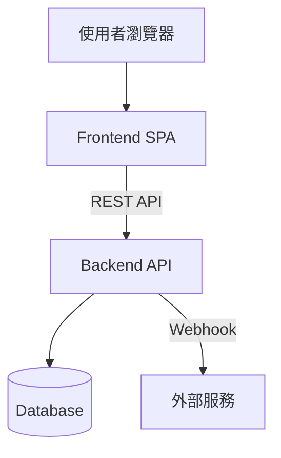

# L0 — 系統概觀模板

> **目標讀者**：所有人（新進工程師、PM、QA、主管）
> **更新頻率**：架構變更時更新，通常數月一次
> **篇幅**：1–3 頁

---

## 模板

```markdown
# {專案名稱}

> **層次**：L0 — 系統概觀
> **最後更新**：{YYYY-MM-DD}
> **狀態**：初版 / 已驗證 / 待更新
> **負責人**：{姓名}

## 1. 專案基本資訊

| 項目         | 說明             |
| ------------ | ---------------- |
| 專案名稱     | {名稱}           |
| 專案代號     | {代號}           |
| Repository   | {URL}            |
| 主要技術棧   | {框架 + 語言 + 建置工具} |
| UI 框架      | {如 Element Plus, MUI, Ant Design} |
| 狀態管理     | {如 Pinia, Redux, Zustand} |
| HTTP Client  | {如 Axios, Fetch, ky} |
| 測試框架     | {如 Vitest, Jest, Playwright} |
| 部署方式     | {如 Docker + Nginx, Vercel, K8s} |
| 環境         | {如 dev / staging / production} |

## 2. 系統架構圖

（用 mermaid flowchart 繪製，重點標示：）
- 系統邊界（什麼在前端、什麼在後端）
- 前後端通訊方式與位址
- 外部服務依賴（監控、分析、第三方 API）
- 資料流方向

## 3. 模組總覽

| 模組       | 路徑前綴      | 職責說明         | 負責人 |
| ---------- | ------------- | ---------------- | ------ |
| {模組名}   | /{path}       | {一句話說明職責}  | {人名} |

## 4. 第三方服務依賴

| 服務       | 用途         | 整合方式       | 備註         |
| ---------- | ------------ | -------------- | ------------ |
| {服務名}   | {用途}       | {SDK / API}    | {補充說明}   |

## 5. 環境變數

| 變數名稱         | 說明         | 範例值       | 必填 | 敏感 |
| ---------------- | ------------ | ------------ | ---- | ---- |
| {ENV_VAR}        | {說明}       | {範例}       | 是/否 | 是/否 |

## 6. 專案目錄結構

（列出 src/ 下的第一層目錄，每個目錄一行簡短說明）

## 7. 架構決策紀錄

記錄可觀察到的系統級設計決策。每個決策用以下格式：

### ADR-{編號}：{決策標題}

- **決策**：{做了什麼選擇}
- **背景**：{在什麼情境下做的決定} [確認] / [推斷]
- **理由**：{為什麼這樣選} [確認] / [推斷] / [待確認]
- **Trade-off**：{接受了什麼代價}
- **證據來源**：{從哪裡推斷出這個決策，如 package.json、config 檔、程式碼模式}

常見的系統級決策：
- 為什麼選這個框架 / 語言？
- 為什麼用 REST 而非 GraphQL（或反之）？
- 為什麼用 Monorepo / Multi-repo？
- 為什麼選這個狀態管理方案？
- 為什麼選這個 CSS 方案（Tailwind / CSS Modules / Styled Components）？
- 為什麼選這個部署方式？
```

---

## 產出指引

### 技術棧識別

掃描以下檔案以快速識別技術棧：

| 檔案 | 可得知的資訊 |
|------|-------------|
| `package.json` | 框架、主要依賴、建置工具、腳本命令 |
| `requirements.txt` / `pyproject.toml` | Python 依賴 |
| `go.mod` | Go 模組與依賴 |
| `Cargo.toml` | Rust 依賴 |
| `tsconfig.json` | TypeScript 設定、路徑別名 |
| `vite.config.*` / `webpack.config.*` / `next.config.*` | 建置設定、代理設定 |
| `.env*` 檔案 | 環境變數清單 |
| `Dockerfile` / `docker-compose.yml` | 部署方式 |
| `.github/workflows/` / `.gitlab-ci.yml` | CI/CD 流程 |

### 模組識別策略

1. 前端：看 `pages/` 或 `views/` 的子目錄 + `stores/` 的檔案劃分 + `router/` 的路由分群，三者的交集通常就是模組邊界
2. 後端：看 `modules/` 或 `controllers/` 的目錄結構 + route prefix 的分群
3. 全端：分別識別前後端的模組，再比對前後端模組之間的對應關係

### 架構圖繪製

使用 ASCII art 或 Mermaid。重點在清楚標示系統邊界、資料流方向、外部依賴位置。

Mermaid 範例：


