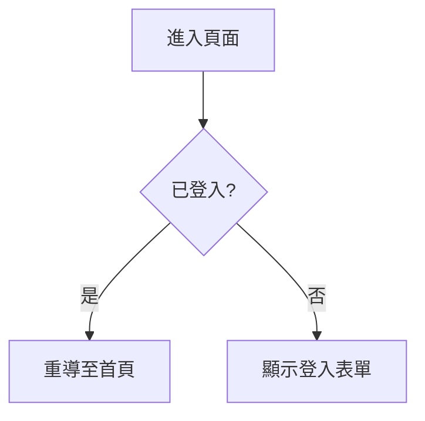
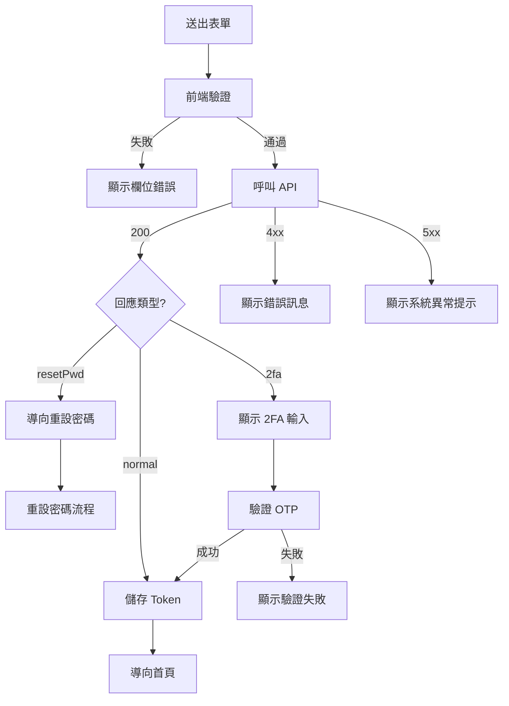
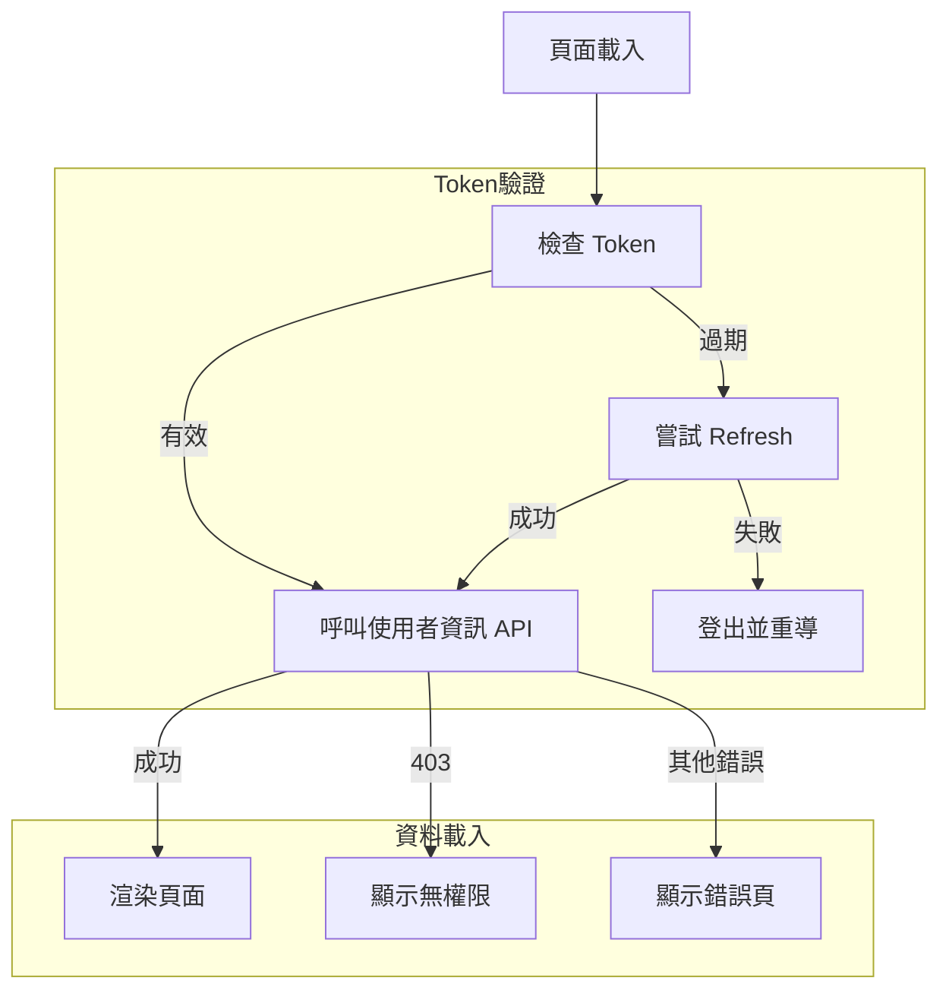

# L2 — 功能規格模板

> **目標讀者**：工程師、QA（可直接轉化為測試案例）
> **更新頻率**：功能行為變更時
> **篇幅**：每個功能 1–3 頁

L2 是整套文件中投資報酬率最高的層次。一份好的 L2 文件應讓 QA 能直接撰寫測試案例，讓新進工程師能在不讀 code 的情況下理解功能的完整行為。

> 框架特定的萃取技巧，根據技術棧載入對應參考文件。

---

## 通用規範

### 流程圖

所有流程相關內容**一律使用 mermaid.js flowchart 語法**繪製，不使用純文字樹狀圖。

**基本範例**（簡單分支）：

````markdown

````

**中等複雜度範例**（條件分支 + 錯誤路徑 + 子流程）：

````markdown

````

**複雜範例**（含 subgraph 分組）：

````markdown

````

### 隱性規則分級

使用 🔴/🟡 分級標記，標準詳見 `references/implicit-rules-standard.md`。

- 🔴 **重構必知**：忽略會直接導致 bug 或功能失效
- 🟡 **資訊性**：有助理解但忽略不會立即出錯

---

## 模板 A：列表/查詢頁面

```markdown
# 功能：{功能名稱}

> **層次**：L2 — 功能規格
> **最後更新**：{YYYY-MM-DD}
> **狀態**：初版 / 已驗證 / 待更新
> **所屬模組**：{模組名}

## 1. 概述

{一兩句話說明功能目的}

## 2. 進入條件

| 條件       | 說明                       |
| ---------- | -------------------------- |
| 路由       | {路由路徑}                 |
| 認證       | {是否需登入}               |
| 角色       | {可存取的角色}             |
| 其他前置條件| {如有}                    |

## 3. 頁面初始載入行為

（使用 mermaid flowchart 描述載入流程，包含成功、空資料、失敗三種路徑）

## 4. 使用者操作

### 4.1 {操作名稱，如「搜尋」}

| 項目       | 說明                             |
| ---------- | -------------------------------- |
| 輸入方式   | {元件類型與 placeholder}          |
| 觸發時機   | {如 debounce 300ms / blur / 按鈕} |
| 行為       | {觸發後做什麼}                    |
| 清除       | {如何清除此操作的效果}            |
| URL 同步   | {是否同步至 URL query}            |

（複雜操作用 mermaid flowchart 繪製分支邏輯）

### 4.2 {操作名稱}

（重複上方格式）

## 5. 資料顯示

### 表格/列表欄位

| 欄位       | 對應 API 欄位 | 格式             | 排序     |
| ---------- | ------------- | ---------------- | -------- |
| {欄位名}   | {api_field}   | {顯示格式}       | {有/無}  |

### 空狀態

{無資料時的顯示內容描述}

## 6. 條件渲染規則

| 條件                     | UI 表現                   |
| ------------------------ | ------------------------- |
| {條件描述}               | {顯示/隱藏/樣式變化}      |

## 7. 錯誤處理

| 錯誤情境               | 處理方式                    |
| ---------------------- | --------------------------- |
| {HTTP 狀態碼或情境}    | {toast / 導向 / 顯示訊息}   |

## 8. 隱性規則

（使用 🔴/🟡 分級標記，標準見 references/implicit-rules-standard.md）

🔴 **{規則名稱}**：{描述}

🟡 **{規則名稱}**：{描述}
```

---

## 模板 B：表單/建立/編輯頁面

```markdown
# 功能：{功能名稱}

> **層次**：L2 — 功能規格
> **最後更新**：{YYYY-MM-DD}
> **狀態**：初版 / 已驗證 / 待更新
> **所屬模組**：{模組名}

## 1. 概述

{功能目的}

## 2. 進入條件

| 條件       | 說明         |
| ---------- | ------------ |
| 路由       | {路由路徑}   |
| 認證       | {認證需求}   |
| 角色       | {角色限制}   |
| 資料前提   | {如：僅 draft 狀態的訂單可進入編輯頁} |

## 3. 表單欄位規格

| 欄位         | 元件型別      | 必填 | 驗證規則                   | 備註           |
| ------------ | ------------- | ---- | -------------------------- | -------------- |
| {欄位名}     | {input 等}    | 是/否| {驗證描述}                 | {補充}         |

### 子表格（如適用）

| 欄位         | 元件型別      | 必填 | 驗證規則                   |
| ------------ | ------------- | ---- | -------------------------- |
| {欄位名}     | {元件型別}    | 是/否| {驗證描述}                 |

子表格操作：
- 新增：{描述}
- 刪除：{描述，含最少保留筆數限制}
- 排序：{如有拖曳排序}

## 4. 表單行為

### 4.1 即時驗證

- {描述驗證觸發時機與行為}

### 4.2 送出流程

（使用 mermaid flowchart 繪製）

### 4.3 離開防護

- {是否有未儲存變更提示}

### 4.4 編輯模式的特殊行為（如適用）

- {載入既有資料的方式}
- {哪些欄位在編輯時不可修改}
- {與新增模式的差異}

## 5. 條件渲染規則

| 條件                     | UI 表現                   |
| ------------------------ | ------------------------- |
| {條件}                   | {表現}                    |

## 6. 錯誤處理

| 錯誤情境               | 處理方式                    |
| ---------------------- | --------------------------- |
| {情境}                 | {處理}                      |

## 7. 隱性規則

🔴 **{規則名稱}**：{描述}

🟡 **{規則名稱}**：{描述}
```

---

## 模板 C：詳情/檢視頁面

```markdown
# 功能：{功能名稱}

> **層次**：L2 — 功能規格
> **最後更新**：{YYYY-MM-DD}
> **狀態**：初版 / 已驗證 / 待更新
> **所屬模組**：{模組名}

## 1. 概述

{功能目的}

## 2. 進入條件

| 條件       | 說明            |
| ---------- | --------------- |
| 路由       | {路由路徑}      |
| 認證       | {認證需求}      |
| 角色       | {角色限制}      |
| 參數       | {如 :id 的來源} |

## 3. 頁面初始載入行為

（使用 mermaid flowchart 繪製載入流程）

## 4. 資訊顯示區塊

### 區塊 A：{區塊名稱，如「基本資訊」}

| 欄位       | 對應 API 欄位 | 格式           |
| ---------- | ------------- | -------------- |
| {欄位名}   | {api_field}   | {顯示格式}     |

### 區塊 B：{區塊名稱}

（表格或子區塊描述）

## 5. 操作按鈕

| 按鈕       | 顯示條件               | 行為                     | 確認提示       |
| ---------- | ---------------------- | ------------------------ | -------------- |
| {按鈕名}   | {何時顯示}             | {點擊後做什麼}            | {有/無/內容}   |

## 6. 條件渲染規則

| 條件                     | UI 表現                   |
| ------------------------ | ------------------------- |
| {條件}                   | {表現}                    |

## 7. 即時更新（如適用）

- {是否有 polling / WebSocket}
- {更新頻率}
- {更新時的 UI 行為}

## 8. 錯誤處理

| 錯誤情境               | 處理方式                    |
| ---------------------- | --------------------------- |
| {情境}                 | {處理}                      |

## 9. 隱性規則

🔴 **{規則名稱}**：{描述}

🟡 **{規則名稱}**：{描述}
```

---

## 模板 D：共用元件

> 適用於被 ≥2 頁面使用、且有非平凡行為的共用元件（如 changePassword、TwoFactorAuth）。
> 純展示元件（如 TfaStatusTag）不需要獨立文件。
> 檔案命名：`shared-{component-name}.md`

```markdown
# 共用元件：{元件名稱}

> **層次**：L2 — 功能規格
> **最後更新**：{YYYY-MM-DD}
> **狀態**：初版 / 已驗證 / 待更新
> **元件檔案**：{components/xxx.vue 的路徑}

## 1. 概述

{元件用途}

## 2. 使用場景

| 使用頁面 | 呼叫方式 | 傳入 Props | 備註 |
| -------- | -------- | ---------- | ---- |
| {頁面名} | {如何觸發掛載} | {關鍵 props} | {差異} |

## 3. Props / 輸入

| Prop | 型別 | 必填 | 預設值 | 說明 |
| ---- | ---- | ---- | ------ | ---- |
| {prop} | {type} | 是/否 | {default} | {description} |

## 4. 元件行為

（使用 mermaid flowchart 繪製主要行為流程）

### 4.1 {行為名稱}

{描述}

## 5. Events / 輸出

| Event | Payload | 說明 |
| ----- | ------- | ---- |
| {event} | {payload} | {description} |

## 6. 條件渲染規則

| 條件 | UI 表現 |
| ---- | ------- |
| {條件} | {表現} |

## 7. 錯誤處理

| 錯誤情境 | 處理方式 |
| -------- | -------- |
| {情境} | {處理} |

## 8. 隱性規則

🔴 **{規則名稱}**：{描述}

🟡 **{規則名稱}**：{描述}
```

---

## 產出指引

### 從程式碼萃取功能規格的通用步驟

#### 步驟 1：識別功能類型

判斷是哪種模板：
- 有列表/表格渲染 + 搜尋/篩選 → 模板 A（列表頁）
- 有表單 + 驗證規則 → 模板 B（表單頁）
- 主要是資料呈現 + 操作按鈕 → 模板 C（詳情頁）
- 被 ≥2 頁面使用 + 有非平凡行為 → 模板 D（共用元件）
- 混合型 → 選最接近的主模板，混入其他模板的區塊

#### 步驟 2：萃取進入條件

從路由定義中找路徑、認證需求、角色限制。

#### 步驟 3：萃取使用者操作

搜尋所有事件綁定（click、input、change、submit、keyup 等），每個事件追蹤到它呼叫的 function，再追蹤 function 做了什麼。

#### 步驟 4：萃取條件渲染規則

搜尋所有條件指令和動態樣式綁定，將每個條件轉換為自然語言描述。

#### 步驟 5：萃取表單驗證規則

從表單驗證定義中萃取欄位型別、必填性、驗證規則。也搜尋自訂 validator function。

#### 步驟 6：識別與分級隱性規則

特別注意以下模式，並依 `references/implicit-rules-standard.md` 分級：

| 模式 | 意義 | 典型分級 |
|------|------|---------|
| `if (x === 數字)` | magic value，查明含義 | 🔴（影響邏輯分支時） |
| `setTimeout` / `debounce` 的延遲值 | 記錄用途與數值 | 🟡 |
| 靜默截斷（如 `.slice()`） | 使用者不知道資料被截斷 | 🔴 |
| 非同步呼叫的固定順序 | API 有順序依賴 | 🔴 |
| 資料格式轉換 | 前後端契約差異 | 🔴 |
| 寫死的特殊判斷 | 業務規則或 workaround | 視情況 |
| 硬編碼的分頁/上限值 | 效能或 UX 相關 | 🟡 |
| 外部服務依賴 | 第三方 API | 🟡 |

#### 步驟 7：識別共用元件

在分析頁面時，若發現某個子元件：
- 被 ≥2 個頁面使用
- 有自己的狀態、API 呼叫、或複雜互動邏輯

則為其建立獨立的 L2 文件（模板 D），頁面文件中改為引用：
```markdown
> 修改密碼功能詳見 `shared-change-password.md`
```
